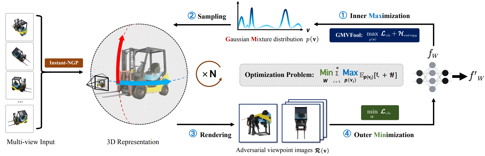

# VIAT: Viewpoint-Invariant Adversarial Training
This repository contains the official implementation of VIAT and GMVFool for the paper ["Towards Viewpoint-Invariant Visual Recognition via Adversarial Training"](https://arxiv.org/pdf/2307.10235.pdf) (ICCV2023) 

By [Shouwei Ruan](https://heathcliff-saku.github.io/), [Yinpeng Dong](https://ml.cs.tsinghua.edu.cn/~yinpeng/), [Hang Su](https://www.suhangss.me/), Jianteng Peng, Ning Chen, [Xingxing Wei](https://sites.google.com/site/xingxingwei1988/)

## ⚙️ 1.Prerequisites
Ensure that you have these environments:
- Pytorch (1.11.0)
- torchvision (0.13.1)
- timm (0.5.4)
- pytorch-lighting(1.6.5)
  
1. For the complete running environment of VIAT, please refer to `./requirements.txt`.
2. (🔥**Extremely important**) Please ensure to follow the [ngp_pl(Instant-NGP based on pytorch-lighting)](https://github.com/kwea123/ngp_pl) to install the relevant environment for Instant-NGP, since VIAT and GMVFool depend on Instant-NGP for viewpoint rendering.

## 💾 2.Datasets
The released data consists of two parts: 
1. `IM3D`: A multi-view dataset used for training, containing 100 hemispherical sampled viewpoint renderings of 1000 virtual 3D objects.
- [IM3D download link (Baiduyun)]()

2. `ImageNet-V+`, A larger adversarial viewpoint benchmark, including 100K adversarial viewpoint samples captured by GMVFool on IM3D.
- [IM3D download link (Google Drive)](https://drive.google.com/file/d/1oxrWl4mRa_mEr-ByCMhyRWaQG8Wribo7/view)

... The code is currently being organized